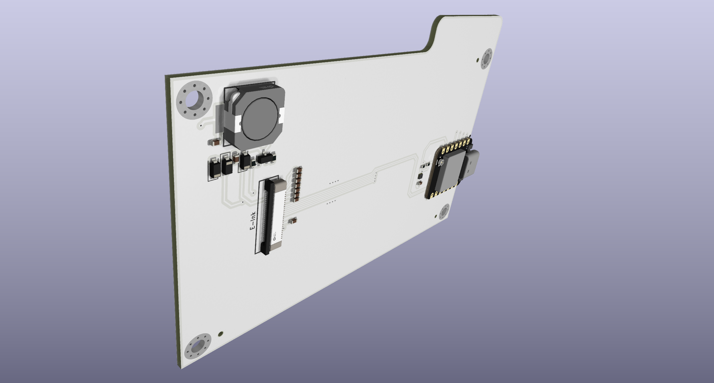
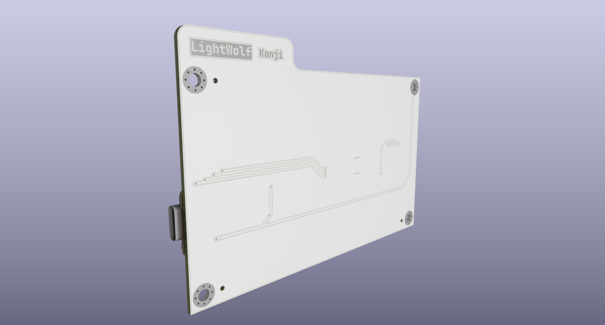
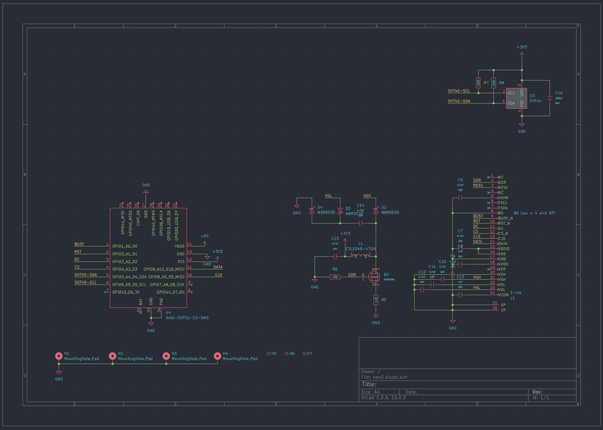

# Kanji

Kanji is an ESP32 based Wi-Fi smart clock. Featuring E-ink display, it can pull weather data, calendar and display realtime clock. It is designed to be a simple and elegant clock that can be placed on a desk. There's also a SHT40 temperature and humidity sensor to provide more information.

Case was not designed and it's intended to just directly use screw as stand.

> Note that display is not here yet because it's going to order seperately.

## Schematic

## BOM

| Name | Qty | Total (USD) | Distributor |
| --- | --- | --- | --- |
| WaveShare E-Ink display & Seeed Xiao ESP32-S3 | 1 | $35.00 | Taobao (Like Aliexpress but China version) |
| PCB Assambly | 1 | $36.70 | JLCPCB |
| PCB | 1 | $10.23 | JLCPCB |
| Shipping | 1 | $6.12 | JLCPCB |
| Total | 1 | $88.05 | - |
